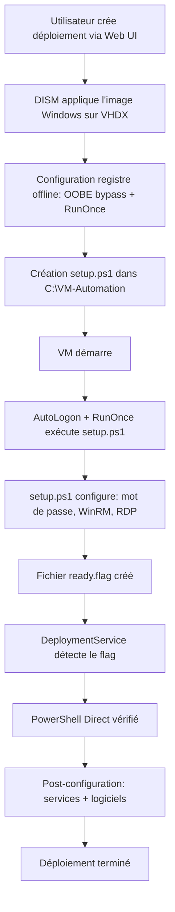

# HANDOFF - Transfert de Session Agent

**Date**: 2026-01-28  
**Session précédente**: Correction Post-Installation Automatique - FONCTIONNEL

---

## ⚠️ Identifiants par Défaut des VMs

| Champ | Valeur |
|-------|--------|
| **Utilisateur** | `.\Administrateur` |
| **Mot de passe** | `TempP@ss123!` |

> **Important Windows FR** : Le compte admin local s'appelle `Administrateur` (pas `Administrator`).  
> Le préfixe `.\` indique un compte local (pas un compte domaine).

---

## État Actuel du Projet

### Ce qui fonctionne ✅

1. **Déploiement DISM Complet** ✅
   - L'endpoint POST `/api/v1/deployments` avec `auto_start: true` lance DISM automatiquement
   - La VM est créée, DISM applique l'image, et la VM démarre
   - Temps total : ~2-3 minutes

2. **Configuration Automatique Post-DISM** ✅ NOUVEAU
   - Script `setup.ps1` créé dans `C:\VM-Automation\`
   - Exécuté automatiquement via **RunOnce** au premier boot
   - Configure : mot de passe Administrateur, WinRM, RDP, firewall
   - Crée le fichier flag `C:\VM-Automation\ready.flag` quand terminé

3. **OOBE Bypass** ✅
   - Configuration du registre offline pour bypass complet
   - Windows boot directement au bureau sans interaction manuelle

4. **PowerShell Direct** ✅
   - Fonctionne automatiquement après le setup
   - Utilise les credentials `("Administrateur", password)`

5. **Post-Installation Automatique** ✅
   - Installation logiciels via Chocolatey
   - Configuration services (SSH, WinRM, RDP)
   - Jonction domaine AD

---

## Workflow de Déploiement



---

## Fichiers de Configuration VM

Après déploiement, les fichiers suivants sont créés dans la VM :

| Chemin | Description |
|--------|-------------|
| `C:\VM-Automation\setup.ps1` | Script de configuration exécuté au boot |
| `C:\VM-Automation\setup.log` | Logs du script de configuration |
| `C:\VM-Automation\ready.flag` | Flag indiquant que le setup est terminé |
| `C:\Windows\Panther\unattend.xml` | Fichier unattend pour OOBE bypass |

---

## Fichiers Clés Modifiés (2026-01-28)

### `src/integrations/hypervisors/hyperv_client.py`

- `deploy_with_dism()` : Crée le script `setup.ps1` et configure RunOnce dans le registre offline
- Utilise `Administrateur` au lieu de `Administrator` (Windows FR)

### `src/domain/deployment_service.py`

- `_wait_for_vm_ready()` : Vérifie le fichier flag `C:\VM-Automation\ready.flag` en 3 phases
- `_execute_fallback_setup()` : Nouvelle méthode de fallback si RunOnce échoue
- Utilise `("Administrateur", password)` pour les credentials

### `templates/unattend/windows_server_2022.xml`

- `<Username>Administrateur</Username>` dans AutoLogon
- `net user Administrateur` dans FirstLogonCommands

---

## Dépannage

### Le flag ready.flag n'est pas créé

1. Vérifier les logs : `C:\VM-Automation\setup.log`
2. Le script RunOnce peut ne pas s'être exécuté si l'AutoLogon a échoué
3. Le fallback automatique tentera d'exécuter le setup manuellement après ~90s

### PowerShell Direct ne fonctionne pas

1. Vérifier que le heartbeat est OK (VM > Properties > Heartbeat)
2. Vérifier les credentials : `.\Administrateur` avec le bon mot de passe
3. Vérifier que WinRM est activé : `Get-Service WinRM`

### Exécuter le setup manuellement

```powershell
# Via Hyper-V Manager, ouvrir une console sur la VM et exécuter :
powershell.exe -ExecutionPolicy Bypass -File C:\VM-Automation\setup.ps1
```

---

## Commandes Utiles

```bash
# Tester la connexion PowerShell Direct
cd /home/otoroot/VM-AUTOMATION && . .venv/bin/activate
python3 -c "
import asyncio
from src.integrations.hypervisors.hyperv_client import HyperVClient
async def test():
    c = HyperVClient()
    result = await c.execute_in_vm(
        'VM_NAME',
        '\$env:COMPUTERNAME',
        ('Administrateur', 'TempP@ss123!'),
        timeout=30
    )
    print(f'Success: {result.success}, Output: {result.output}')
    c.close()
asyncio.run(test())
"

# Vérifier le fichier flag
python3 -c "
import asyncio
from src.integrations.hypervisors.hyperv_client import HyperVClient
async def check():
    c = HyperVClient()
    result = await c.execute_in_vm(
        'VM_NAME',
        'if (Test-Path \"C:\\VM-Automation\\ready.flag\") { \"FLAG OK\" } else { \"NO FLAG\" }',
        ('Administrateur', 'TempP@ss123!'),
        timeout=30
    )
    print(result.output)
    c.close()
asyncio.run(check())
"
```

---

## ClickUp

- **Task ID**: 869bxaf8k
- **Dernier statut**: in progress
- **Dernière mise à jour**: 2026-01-28 - Post-installation automatique corrigée

---

## Git

Branch actuelle : `fix/869bxxy54-bug-fixes`

```bash
git log --oneline -5
# Vérifier les derniers commits
```

---

*Document mis à jour le 2026-01-28 pour refléter les corrections de post-installation automatique*
